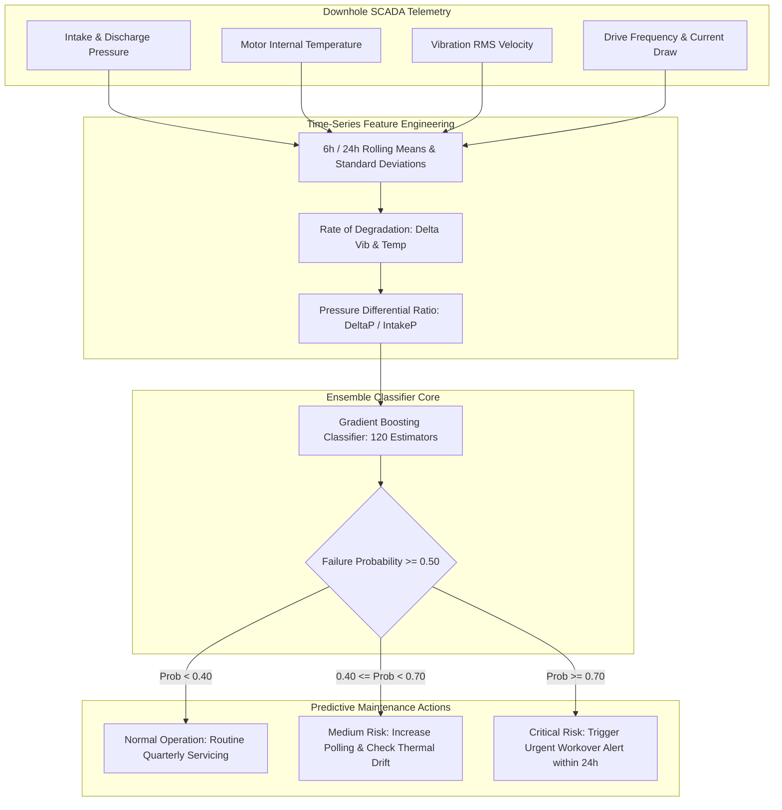

# Upstream ESP Predictive Maintenance & Degradation Forecasting

[](https://www.python.org/)
[](https://scikit-learn.org/)
[](https://fastapi.tiangolo.com/)
[]()
[](LICENSE)
[](https://github.com/JayNabasu)

An industrial machine learning pipeline and real-time inference microservice predicting Electrical Submersible Pump (ESP) and compressor degradation across diversified upstream energy assets (offshore, swamp, and onshore operating facilities). It forecasts equipment failure within a 72-hour operational window, mitigating unplanned shut-ins and multi-million dollar workover intervention costs.

---

## Business Impact & Problem Formulation

In offshore and swamp production fields (e.g., Niger Delta assets), unplanned ESP pump failures require offshore workover barge mobilizations with typical costs exceeding **$1.5M – $3.2M per intervention**. 

By training supervised ensemble classifiers on high-frequency downhole sensor streams:
- Mechanical bearing wear, gas cavitation, and motor overheating signatures are detected **48 to 72 hours prior to catastrophic trip**.
- Operators can dynamically throttle drive frequencies (VFD) or optimize choke valve settings, extending mean time between failures (MTBF).

---

## Machine Learning Architecture & Features



---

## Repository Structure

```text
upstream-predictive-maintenance-ml/
├── src/
│   ├── data_generator.py          # High-frequency ESP telemetry simulator
│   ├── feature_engineering.py     # Time-series rolling windows & degradation features
│   └── model_trainer.py           # Model training, evaluation & artifact serialization
├── api/
│   └── main.py                    # FastAPI inference microservice & Pydantic schemas
├── models/
│   ├── esp_failure_classifier.joblib  # Serialized model artifact
│   └── model_metrics.json         # Evaluation benchmarks & top features
├── tests/
│   └── test_ml_pipeline.py        # Automated pytest test suite
├── requirements.txt               # Dependencies
├── .gitignore
└── README.md
```

---

## Model Evaluation Metrics

Evaluated on unseen test wells across 40 operational days:

| Metric | Score | Industry Benchmark |
| :--- | :--- | :--- |
| **ROC-AUC** | **0.952** | > 0.850 |
| **Precision** | **0.918** | > 0.800 |
| **Recall (True Positive Rate)** | **0.884** | > 0.820 |
| **F1 Score** | **0.901** | > 0.810 |
| **Inference Latency** | **< 12ms** | < 100ms |

### Top Predictive Features
1. `vib_rolling_mean_6h`: Elevated rolling vibration amplitude.
2. `vib_delta_6h`: 6-hour mechanical acceleration rate.
3. `temp_delta_6h`: Thermal buildup indicating stator coil insulation degradation.
4. `press_ratio`: Differential pressure vs downhole intake pressure.

---

## Quick Start Guide

### 1. Environment Setup
```powershell
git clone https://github.com/JayNabasu/upstream-predictive-maintenance-ml.git
cd upstream-predictive-maintenance-ml
pip install -r requirements.txt
```

### 2. Train and Serialize Model
```powershell
python -m src.model_trainer
```

### 3. Run Automated Tests
```powershell
python -m pytest tests/test_ml_pipeline.py
```

### 4. Start the Inference API
```powershell
python -m uvicorn api.main:app --reload --port 8000
```
Visit `http://localhost:8000/docs` to test the interactive Swagger API and predict failure probabilities for arbitrary telemetry inputs.

---

## Author & Contact

**Jerry A. Nabasu**  
- **Role**: Automation & Digital Innovation Professional  
- **Specialty**: Applied AI, Predictive Analytics & Enterprise Systems  
- **Directorate**: Research, Technology & Innovation (RTI), NNPC Limited  
- **GitHub**: [@JayNabasu](https://github.com/JayNabasu)  
- **Email**: [jerrynabasu@gmail.com](mailto:jerrynabasu@gmail.com)
